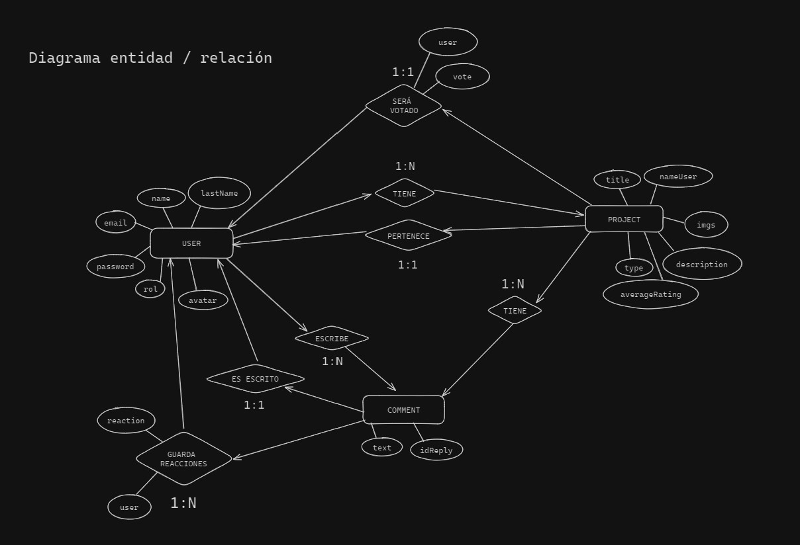

# BACKEND PARA PROYECTOS RTC

## Descripción

Este proyecto surge de querer generar un poco más de comunidad entre l@s alumn@s de Rock The Code y que también se motiven unas personas a otras para realizar mejores proyectos.  
Hemos querido desarrollar un servidor que nos permita generar usuarios de manera controlada mediante nuestro perfil administrador.  
A estos usuarios generados les llega un correo electrónico con las indicaciones a seguir para cambiar la contraseña y poder disfrutar del uso completo de la página al tener una cuenta.  
La idea, es que personas que **NO pertenezcan** a Rock The Code, puedan ver los proyectos realizados por estas personas, cuales son los mejores y ver qué se está "cocinando" en dicho programa.

Las personas pertenecientes a dicho programa y que tengan una cuenta en la página, podrán, además de hacer lo que cualquiera sin cuenta, hacer lo siguiente:

- Modificar su usuario
- Eliminar su usuario
- Subir un proyecto
- Eliminar su proyecto
- Modificar su proyecto
- Votar en proyectos
- Comentar en proyectos
- Reaccionar a comentarios
- Comentar en proyectos referenciandose a otros comentarios previos
- Eliminar sus propios comentarios

## Prueba

Si eres alumn@ de Rock The Code o te interesa ver la funcionalidad del proyecto en vivo, podrás probarlo de la siguiente manera:

- Clonar el repositorio (terminal):

```sh
git clone https://github.com/Corocottax/Projects_RTC_backend.git
```

- Entrar al proyecto e instalar las dependencias:

```sh
npm i
```

- Rellenar el .env con vuestras variables de entorno:

```
DB_URL=
JWT_SECRET=
USER_MAILER=
PASSWORD_MAILER=
CLOUD_NAME=
API_KEY=
API_SECRET=
```

- Ejecutar uno de los scripts de nuestro proyecto:

```
npm run start
npm run dev
```

- Probar con Insomnia / Postman (para crear un primer usuario recomendamos desactivar la validación de la función de registro)

## Lógica de negocio

### Diagrama entidad / relación



### Endpoints Users

| NAME        | METHOD | ENDPOINT        | AUTH              | BODY                                                        | CONTENT-TYPE     | RESPONSE        |
| ----------- | ------ | --------------- | ----------------- | ----------------------------------------------------------- | ---------------- | --------------- |
| REGISTER    | POST   | /users/register | admin             | { **email**, **password**, **name**, **lastName**, avatar } | application/json | { user }        |
| LOGIN       | POST   | /users/login    | ---               | { **email**, **password** }                                 | application/json | { token, user } |
| GET USERS   | GET    | /users          | ---               | ---                                                         | ---              | [ users ]       |
| GET USER    | GET    | /users/:id      | ---               | ---                                                         | ---              | { user }        |
| MODIFY USER | PUT    | /users/:id      | admin or sameUser | **user data**                                               | application/json | { user }        |
| DELETE USER | DELETE | /users/:id      | admin or sameUser | ---                                                         | ---              | { user }        |

### Endpoints Projects

| NAME              | METHOD | ENDPOINT               | QUERY PARAMS             | AUTH | BODY | CONTENT-TYPE | RESPONSE               |
| ----------------- | ------ | ---------------------- | ------------------------ | ---- | ---- | ------------ | ---------------------- |
| GET PROJECTS      | GET    | /projects              | page                     | ---  | ---  | ---          | { info, [ projects ] } |
| GET PROJECT BY ID | GET    | /projects/:id          | ---                      | ---  | ---  | ---          | { project }            |
| GET BEST PROJECTS | GET    | /projects/bestprojects | ---                      | ---  | ---  | ---          | [ projects ]           |
| FILTER PROJECTS   | GET    | /projects/filter       | page, type, name, rating | ---  | ---  | ---          | { info, [ projects ] } |
| CREATE PROJECT    | POST   | ---                    | ---                      | ---  | ---  | ---          | ---                    |
| MODIFY PROJECT    | PUT    | ---                    | ---                      | ---  | ---  | ---          | ---                    |
| ADD INTERACTION   | PUT    | ---                    | ---                      | ---  | ---  | ---          | ---                    |
| DELETE PROJECT    | DELETE | ---                    | ---                      | ---  | ---  | ---          | ---                    |

### Endpoints Comments

| NAME            | METHOD | ENDPOINT | QUERY PARAMS | AUTH | BODY | CONTENT-TYPE | RESPONSE |
| --------------- | ------ | -------- | ------------ | ---- | ---- | ------------ | -------- |
| PUBLISH COMMENT | POST   | ---      | ---          | ---  | ---  | ---          | ---      |
| ADD INTERACTION | PUT    | ---      | ---          | ---  | ---  | ---          | ---      |
| DELETE COMMENT  | DELETE | ---      | ---          | ---  | ---  | ---          | ---      |
